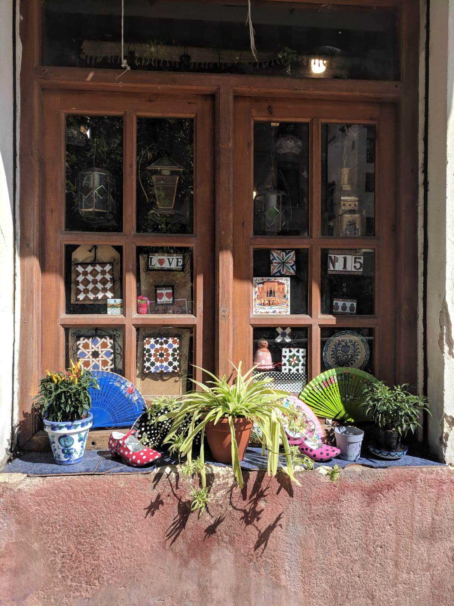
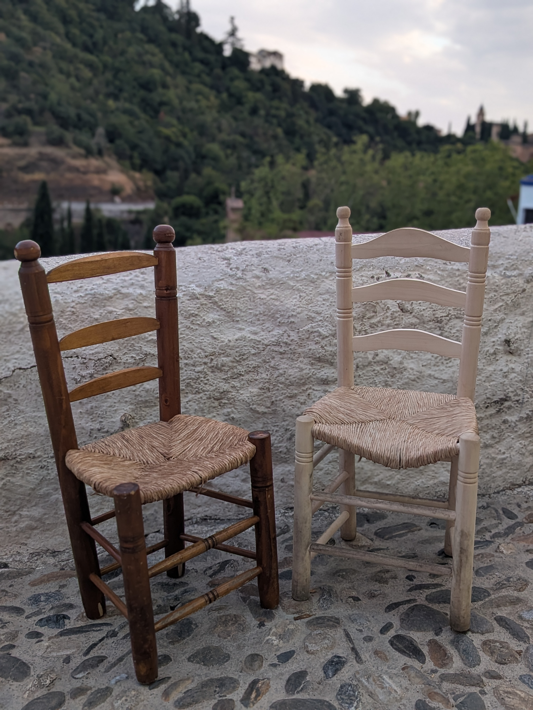

::: {.page-banner}
# About us
:::

::: {.section-heading}
The project
:::

::: {.block .wide-text}
::: {.block-image .tall}

:::

::: {.block-text}
## Your placeta in Granada

La Placeta Granada was born from the idea of bringing together and connecting people from different places and backgrounds —building a great global village, respectful of both guest and host. 
We believe the best way to know a city is the way its own neighbours do: slowly, through daily life rather than a checklist of sights. La Placeta Granada is our invitation to step into that rhythm —real streets, real conversations, real connection. 

Granada is the location we have chosen for our work, not only because of our personal ties to the city, but also because of the richness and diversity of its social and cultural ecosystem. A cradle of great artists from the medieval Al-Andalus period to the present day, its contrast of cultures – cultured, popular, religious, secular, academic, scientific, cosmopolitan and local – forms the bedrock of many of the artistic creations of artists born in, based in or passing through the city. Its past, marked by struggles and losses, by the decline and destruction of part of its historical, artistic and natural heritage, also shapes the city’s present reality.

For those of us who make up La Placeta Granada, being aware of this legacy drives us to care for it, but also to share it with those who show a genuine interest in learning about the ways of life within Granada’s culture, where – particularly in its neighbourhoods – the customs and traditions of previous generations coexist with new forms of global sociability.

[Discover our programmes →](programmes.qmd){.cta-link}
:::
:::

::: {.section-heading}
Our team
:::

::: {.block .reverse .wide-text}
::: {.block-image .tall}

:::

::: {.block-text}
## Behind every stay

Every La Placeta Granada programme is run by a small, dedicated team: specialised teaching staff and technical support committed to making each stay feel like coming home, not just visiting.
:::
:::

::: {.section-heading}
Our principles
:::

::: {.principles}
::: {.principle-card}
### Connection over sightseeing

We measure a good stay in conversations, not checklists — meeting neighbours, not just monuments.
:::

::: {.principle-card}
### Respect, both ways

For the guest discovering Granada, and for the host welcoming them into their everyday life.
:::

::: {.principle-card}
### A slower pace

Time to sit, talk and belong — not rush from one sight to the next.
:::

::: {.principle-card}
### Sustainable, local growth

Tourism that gives back to the neighbourhoods that host us, supporting local life rather than displacing it.
:::
:::
