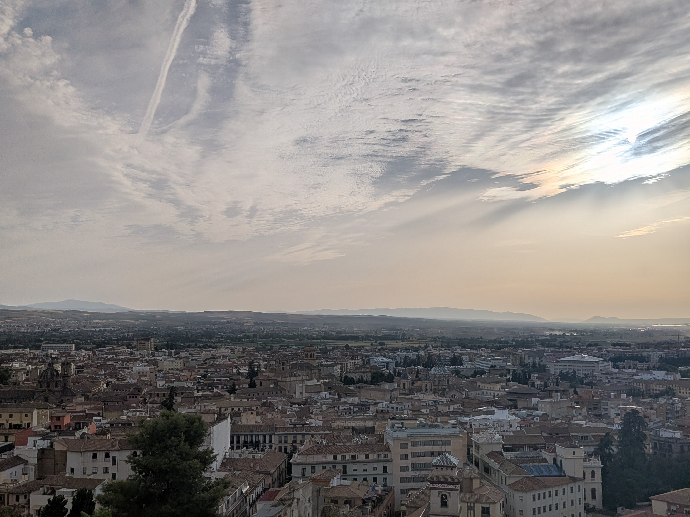

::: {.page-banner}
# Giving Back

Giving back to the neighbourhoods that host us is one of La Placeta Granada's founding goals — supporting social projects that strengthen the social fabric of Granada's barrios.
:::

::: {.block}
::: {.block-image}

:::

::: {.block-text}
::: {.eyebrow}
Local by design
:::

## Built together with the neighbourhood

When we design our programmes, we prioritise activities run together with local entities and associations — collaborations that enrich both our international guests and the neighbours who welcome them.

::: {.stat-inline}
::: {.stat-number}
10%
:::

::: {.stat-text}
of our profits go directly to local projects and associations that strengthen integration and everyday life in Granada's neighbourhoods.
:::
:::
:::
:::

::: {.content-hidden}

::: {.divider}
:::

::: {.orgs-section}
## Who we collaborate with

::: {.sub}
Organisations we work alongside when designing and running our programmes.
:::

::: {.orgs-grid}
::: {.org-placeholder}
Logo TBC
:::
::: {.org-placeholder}
Logo TBC
:::
::: {.org-placeholder}
Logo TBC
:::
::: {.org-placeholder}
Logo TBC
:::
:::
:::

::: {.orgs-section}
## Who we support

::: {.sub}
Local associations and projects that receive part of our profits.
:::

::: {.orgs-grid}
::: {.org-placeholder}
Logo TBC
:::
::: {.org-placeholder}
Logo TBC
:::
:::
:::
:::

::: {.closing-cta}
## Curious to know more?

Get in touch if you'd like to know more about our local partners and social commitment.

[Contact us](contact.qmd){.btn}
:::
