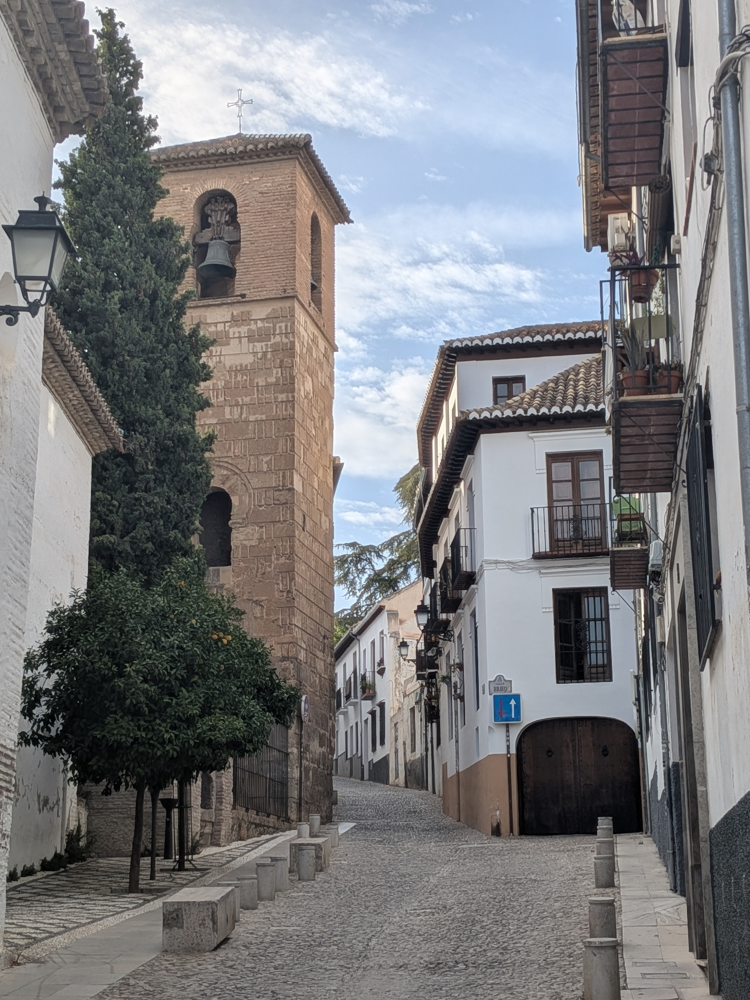
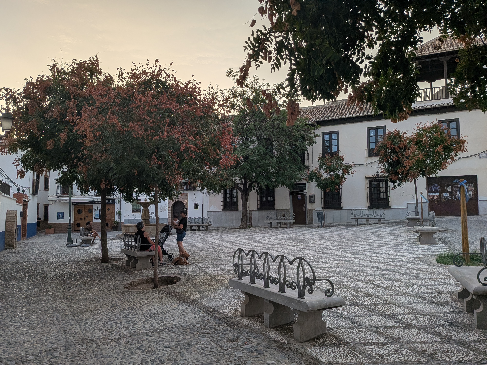
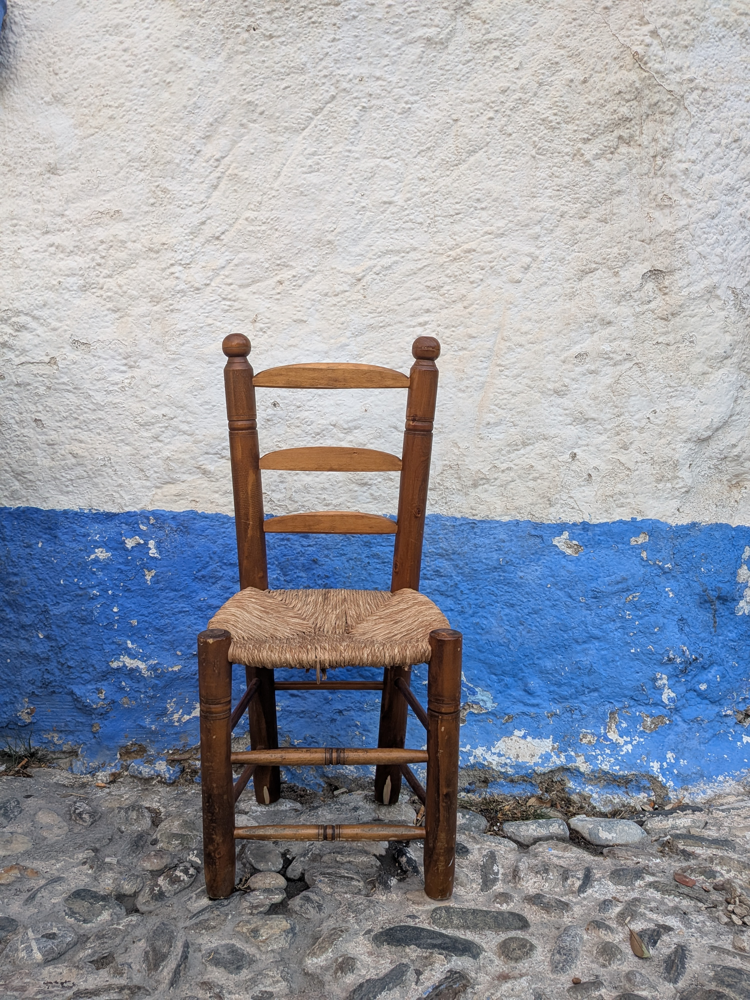

::: {.hero}
::: {.hero-left}
::: {.hero-left-top}
{.iso}

# La Placeta Granada
:::

::: {.slogan}
Take a seat in Granada
:::
:::

::: {.hero-right}
In Granada, a "placeta" is a hidden square where neighbours meet to share stories, time and life. Welcome to your placeta.
:::
:::

::: {.quotes-block}
::: {.quotes}
Me voy a la placeta
Los niños están jugando en la placeta
¿Te bajas a la placeta?
:::

::: {.placeta-explain}
## What is a "placeta"?

In Granada, a placeta is a small square where neighbours gather — a public space that becomes, casually and unhurriedly, a meeting point.

A few decades ago, when street life in the neighbourhoods was far more common than it is today, placetas (and their linguistic family — plazuelas, plazas, placitas) were fundamental to the fabric of community. Being in the placeta, almost daily, "made neighbourhood": children playing freely, grandmothers keeping each other company, young people chatting for hours on a bench, and men and women who would bring down their own chairs simply to sit, talk and pass the time.

::: {.lead-quote}
La Placeta Granada was born from that idea: bringing you into the everyday rhythm of the city, not a postcard version of it.
:::
:::

::: {.photo-strip}

:::
:::

::: {.programme-teaser}
## Spanish & Local Experience

A slow-paced, community-rooted stay in Granada — Spanish lessons, local life and real connection. Spring & Autumn.

[See the programme](programmes.qmd){.btn}
:::
