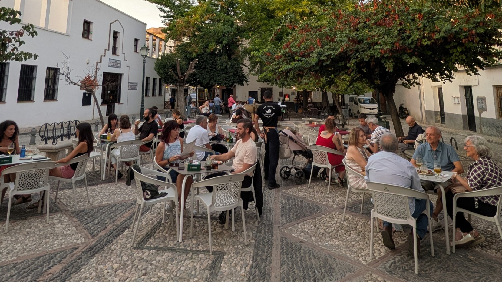
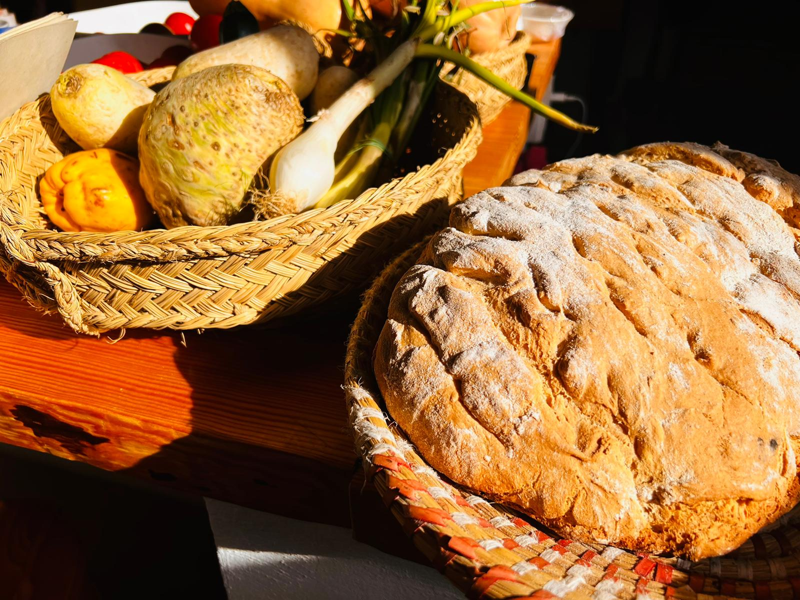

::: {.page-banner}
# Programmes

Slow-paced, community-rooted stays in Granada — built for the curious over 50. Explore what's on offer below.
:::

::: {.programmes-layout}
::: {.programmes-list}

::: {#sle .prog-card}
::: {.photo}

:::

::: {.body}

## Spanish & Local Life

::: {.blurb}
A slow-paced stay built around real neighbourhood life: daily Spanish classes, guided walks through the Albaicín and lesser-known placetas, and the everyday rhythm of Granada — not a tourist checklist.
:::

::: {.actions}
[Download full programme (PDF)](/programmes/laplaceta-spa-local-life-programme.pdf){.btn .secondary}
:::

View details

::: {.details-grid}
Duration & dates
: 2 weeks · offered in Spring (April–May) and Autumn (September–October)

Who it's for
: Adults 50+ curious about Spanish language and culture — no prior experience needed

Group size & level
: Small groups (max. 10 people) · basic Spanish welcome

What's included
: Daily Spanish classes, guided neighbourhood walks, cultural workshops, welcome dinner and local excursions

Price
: From €2,800

How to apply
: Get in touch via [info@laplacetagranada.com](mailto:info@laplacetagranada.com) — we'll guide you through the rest
:::

::: {.pdf-note}
Full itinerary, exact dates and terms are detailed in the downloadable programme PDF.
:::

:::
:::

::: {#ctnfe .prog-card .coming-soon}
::: {.photo}

:::

::: {.body}
::: {.badge-soon}
Coming soon
:::

## Curious Travellers: Nature & Food Experience

::: {.blurb}
A new programme exploring Granada's landscapes and food culture — details coming soon.
:::

::: {.actions}
[Get notified when it launches](contact.qmd){.btn .secondary}
:::
:::
:::

:::

::: {.side-nav}
::: {.side-nav-title}
Programmes
:::

[Spanish & Local Life](#sle)

[Curious Travellers [Coming soon]{.tag}](#ctnfe)
:::
:::
